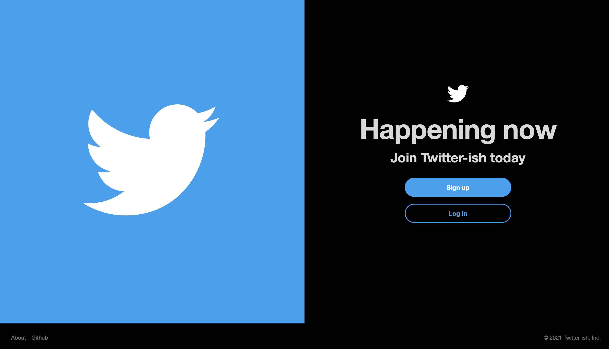

## Rails Capstone Project: Twitter Redesign
Based on Twitter, the redesign is a desktop web app that allows users to share opinions and follow other users

## Live Link
Visit [Twitter-ish](https://twitter-ish.herokuapp.com/)
### Objectives:
- Building a RESTful application
- Application of the MVC design architecture
- Using Active Record associations, queries and validations
- Implementing intuitive user experience and aesthetic interface

## Features

> On Twitter-ish, a user can sign-up with only their names and username. The photo and cover image are optional on sign up
> as defaults will be applied. Users can however, edit their profile and upload their preferred photos. The maximum allowable
> sizes are 2MB and 4MB for photo and cover image resectively. Users can share opinions and follow users. Subsequent iterations
> will provide pagination.

## Prerequisites
- Internet connection

## Tools / Built With
- Ruby 3.0.
- Rails 6.1.3
- Bootstrap 5
- Node.js
- Amazon AWS S3
- Yarn

## Getting Started
- To get started with the app, clone this project by running `git clone https://github.com/george-swift/twitter-ish.git`
- Run `bundle install` to install the needed packages
- Run `yarn install` to install the dependencies
- Next, migrate the database to your environment: `rails db:migrate`
- Finally, run the test suite to verify that everything is working correctly: `rails test`
- If the test suite passes, you are ready to run the app in a local server. Execute `rails s` to fire up the server
- Visit `http://localhost:3000/` in your browser to run the app in a local server
- You can then sign up with required details
- To terminate the server, enter `Ctrl + C` in your terminal

## Testing
- Unit and integration tests are implemented with Rspec
- To verify these tests, run `bin/rails spec`
- To get a verbose format of the implemented tests, run `bin/rails spec SPEC_OPTS="--format=doc"`

## Authors

👤 &nbsp; **Ubong George**
- LinkedIn: [Ubong George](https://www.linkedin.com/in/ubong-itok)
- Twitter: [@\_\_pragmaticdev](https://twitter.com/__pragmaticdev)
- GitHub: [@george-swift](https://github.com/george-swift)

## Acknowledgments

- Ruby on Rails Guide and API docs for technical information with Rails
- [Icons8](https://icons8.com/) for icons used in design
- Gregoire Vella for inspiration on [Behance](https://www.behance.net/gallery/14286087/Twitter-Redesign-of-UI-details)
- Unsplash creative [Julian Böck](https://unsplash.com/@julian_bck) for default cover image on Twitter-ish

## Show your support

Leave a :star:️ &nbsp; if you like this project!

## License

Available as open source under the terms of the [MIT License](https://opensource.org/licenses/MIT).
